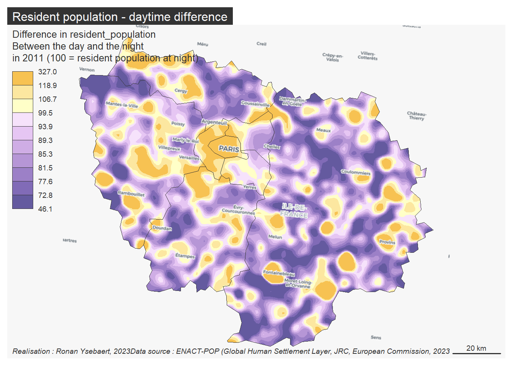

## Population over the day, the night, the seasons

The ENACT-POP R2020A dataset is a spatial raster dataset provided by JRC (Schiavina et al. (2020)). It depicts the seasonal nightime and daytime population in a 1km grid resolution for 2011. It covers EU28.

The GHSL - Global Human Settlement Layer proposes a data viewer to interactively explore the results, here. However, the tool is not especially suitable to :

- Compare monthes, daytime and nightime. The user must change the layer selected manually.
- Observe spatial trends outside the mosaic of grid cells.

We propose in this notebook a methodological framework for analysing the seasonal and daytime changes based on spatial interpolation method (Stewart (1942)), allowing to observe the phenomenon on a continuous surface from a set of discrete points.




### Usage

Attribution-ShareAlike 4.0 International (CC BY-SA 4.0)

This is a human-readable summary of (and not a substitute for) the license. Disclaimer.
You are free to:
* Share — copy and redistribute the material in any medium or format
* Adapt — remix, transform, and build upon the material for any purpose, even commercially.

This license is acceptable for Free Cultural Works. The licensor cannot revoke these freedoms as long as you follow the license term.

### Citation

```
@online{ysebaert2023,
  author = {Ronan Ysebaert},
  title = {Population over the Day, the Night, the Seasons},
  date = {2023-10},
  langid = {en}
}
```
